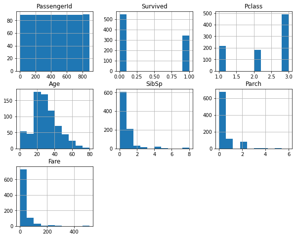
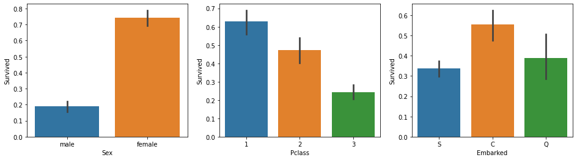
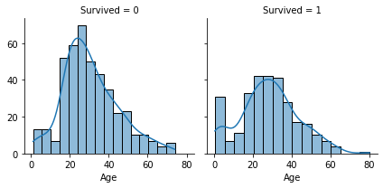
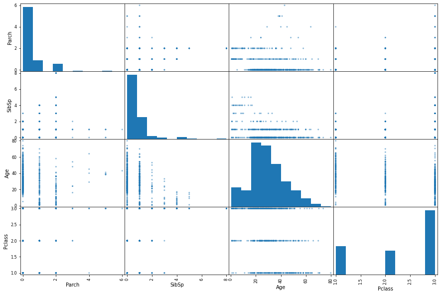
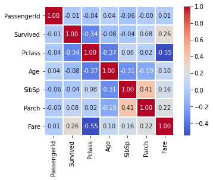

# Titanic: Investigando o naufrágio através dos dados.

O desafio do Titanic ficou popularmente conhecido por conta do [Kaggle](https://https://www.kaggle.com/), e é considerado um dos passos iniciais na área de machine learning. 

Em 15 de abril de 1912, ao colidir com um *iceberg*, o Titanic naufragou, ocasionando a morte de 1502 pessoas - de um total de 2224. 

**Utilizando uma base de dados real, o objetivo desse desafio é mensurar a chance de sobrevivencia dos passageiros do Titanic, de acordo com suas características.**

# Checklist do relatório:


1.   Definição do Problema; 
2.   Obtenção de Dados;
3. Exploração de Dados;
4. Preparação dos Dados;
5. Construção do Modelo;
6. Avaliação.


# 1. Definição do Problema

O naufrágio do Titanic é um dos mais famosos da história, e ocorreu na sua viagem inaugural, em abril de 1912, quando era considerado "inaufragável". Com a ausência de botes salva-vidas para todos, houve a morte de 1.502 pessoas entre os 2.224 passageiros e tripulantes.

Apesar do fator sorte envolvido na sobrevivência, analisando os dados é possível perceber que determinados grupos de pessoas tinham mais chance de sobreviver que outros.

A descrição do desafio e o dataset estão disponíveis na página do Kaggle: [Titanic - Machine Learning from Disaster](https://https://www.kaggle.com/c/titanic)

# Objetivo

Construção de um modelo preditivo, que utilize os dados dos passageiros para responder quais grupos de pessoas têm mais probabilidade de sobrevier.


# Métrica de desempenho

O score é calculado baseado no número de previsões corretas do modelo, ou seja, considera a acurácia do modelo.


# 2. Obtenção dos Dados 

O Kaggle disponibilizou os dados em dois grupos: 

* Dataset de treino - ```train.csv```
  * Esse dataset informa se o passageiro sobreviveu ou não e deve ser usado para desenvolver o modelo de Machine Learning.
  * Possui diversas *features*, como classe, idade e gênero do passageiro.

* Dataset de Teste - ```test.csv```
  * Esse conjunto de dados não informa se o passageiro sobreviveu ou não e deve ser usado como dados que nunca foram vistos pelo modelo.

O Kaggle disponibiliza um modelo de como as previsões devem ser submetidas à plataforma (```gender_submission```)


```python
#pacotes necessários

import pandas as pd
import numpy as np
import matplotlib.pyplot as plt
import seaborn as sns

#visualizar todas as colunas
pd.options.display.max_columns = None
```


```python
train = pd.read_csv('./datasets/train.csv')
test = pd.read_csv('./datasets/test.csv')
```


```python
#verificando as dimensões do DataFrame

print(f'BASE TREINO\nVariáveis:\t{train.shape[1]}\nEntradas:\t{train.shape[0]}\n')
print(f'BASE TESTE\nVariáveis:\t{test.shape[1]}\nEntradas:\t{test.shape[0]}')
```

    BASE TREINO
    Variáveis:	12
    Entradas:	891
    
    BASE TESTE
    Variáveis:	11
    Entradas:	418
    

# 3. Exploração de Dados

O estudo de cada variável é realizado, com atenção aos seus nomes, tipos, porcentagem de valores ausentes, outliers e tipos de distribuição. 

O modelo utilizado é classificado como de Aprendizado Supervisionado (*Supervised Learning*) e a variável alvo (*target*) é a variável ```Survived```.


# Dicionário de Dados

* **PassengerId:** Número de identificação do passageiro
* **Survived:** Informa se o passageiro sobreviveu ao desastre
    * 0 = Não
    * 1 = Sim
* **Pclass:** Classe do bilhete
    * 1 = 1ª Classe
    * 2 = 2ª Classe
    * 3 = 3ª Classe
* **Name:** Nome do passageiro
* **Sex:** Sexo do passageiro
* **Age:** Idade do passageiro
* **SibSp:** Quantidade de cônjuges e irmãos a bordo
* **Parch:** Quantidade de pais e filhos a bordo
* **Ticket:** Número da passagem
* **Fare:** Preço da Passagem
* **Cabin:** Número da cabine do passageiro
* **Embarked:** Porto no qual o passageiro embarcou
    * C = Cherbourg
    * Q = Queenstown
    * S = Southampton


## Tipos das Variáveis

* Variáveis Numéricas
    * Discretas
        * Pclass
        * SibSp
        * Parch
    * Contínuas
        * Age
        * Fare
    * Alvo
        * Survived
    * Chave Primária
        * PassengerId
* Variáveis Categóricas
    * Name
    * Sex
    * Ticket
    * Cabin
    * Embarked


```python
#identificando os tipos de cada variável

display(train.dtypes)

#5 primeiras entradas do conjunto de treino

display(train.head())
```


    PassengerId      int64
    Survived         int64
    Pclass           int64
    Name            object
    Sex             object
    Age            float64
    SibSp            int64
    Parch            int64
    Ticket          object
    Fare           float64
    Cabin           object
    Embarked        object
    dtype: object


<div>
<style scoped>
    .dataframe tbody tr th:only-of-type {
        vertical-align: middle;
    }

    .dataframe tbody tr th {
        vertical-align: top;
    }

    .dataframe thead th {
        text-align: right;
    }
</style>
<table border="1" class="dataframe">
  <thead>
    <tr style="text-align: right;">
      <th></th>
      <th>PassengerId</th>
      <th>Survived</th>
      <th>Pclass</th>
      <th>Name</th>
      <th>Sex</th>
      <th>Age</th>
      <th>SibSp</th>
      <th>Parch</th>
      <th>Ticket</th>
      <th>Fare</th>
      <th>Cabin</th>
      <th>Embarked</th>
    </tr>
  </thead>
  <tbody>
    <tr>
      <th>0</th>
      <td>1</td>
      <td>0</td>
      <td>3</td>
      <td>Braund, Mr. Owen Harris</td>
      <td>male</td>
      <td>22.0</td>
      <td>1</td>
      <td>0</td>
      <td>A/5 21171</td>
      <td>7.2500</td>
      <td>NaN</td>
      <td>S</td>
    </tr>
    <tr>
      <th>1</th>
      <td>2</td>
      <td>1</td>
      <td>1</td>
      <td>Cumings, Mrs. John Bradley (Florence Briggs Th...</td>
      <td>female</td>
      <td>38.0</td>
      <td>1</td>
      <td>0</td>
      <td>PC 17599</td>
      <td>71.2833</td>
      <td>C85</td>
      <td>C</td>
    </tr>
    <tr>
      <th>2</th>
      <td>3</td>
      <td>1</td>
      <td>3</td>
      <td>Heikkinen, Miss. Laina</td>
      <td>female</td>
      <td>26.0</td>
      <td>0</td>
      <td>0</td>
      <td>STON/O2. 3101282</td>
      <td>7.9250</td>
      <td>NaN</td>
      <td>S</td>
    </tr>
    <tr>
      <th>3</th>
      <td>4</td>
      <td>1</td>
      <td>1</td>
      <td>Futrelle, Mrs. Jacques Heath (Lily May Peel)</td>
      <td>female</td>
      <td>35.0</td>
      <td>1</td>
      <td>0</td>
      <td>113803</td>
      <td>53.1000</td>
      <td>C123</td>
      <td>S</td>
    </tr>
    <tr>
      <th>4</th>
      <td>5</td>
      <td>0</td>
      <td>3</td>
      <td>Allen, Mr. William Henry</td>
      <td>male</td>
      <td>35.0</td>
      <td>0</td>
      <td>0</td>
      <td>373450</td>
      <td>8.0500</td>
      <td>NaN</td>
      <td>S</td>
    </tr>
  </tbody>
</table>
</div>


##Porcentagem de valores ausentes

A variável ```Cabin``` é a que possui mais valores ausentes, 77%. A coluna ```Age``` vem em seguida, com mais de 19%, e a coluna ```Embarked``` possui 2% de valores ausentes.


```python
#porcetagem de valores ausentes

(train.isnull().sum() / train.shape[0]).sort_values(ascending=False)
```


    Cabin          0.771044
    Age            0.198653
    Embarked       0.002245
    PassengerId    0.000000
    Survived       0.000000
    Pclass         0.000000
    Name           0.000000
    Sex            0.000000
    SibSp          0.000000
    Parch          0.000000
    Ticket         0.000000
    Fare           0.000000
    dtype: float64


##Distribuição estatística dos dados


```python
train.describe()
```


<div>
<style scoped>
    .dataframe tbody tr th:only-of-type {
        vertical-align: middle;
    }

    .dataframe tbody tr th {
        vertical-align: top;
    }

    .dataframe thead th {
        text-align: right;
    }
</style>
<table border="1" class="dataframe">
  <thead>
    <tr style="text-align: right;">
      <th></th>
      <th>PassengerId</th>
      <th>Survived</th>
      <th>Pclass</th>
      <th>Age</th>
      <th>SibSp</th>
      <th>Parch</th>
      <th>Fare</th>
    </tr>
  </thead>
  <tbody>
    <tr>
      <th>count</th>
      <td>891.000000</td>
      <td>891.000000</td>
      <td>891.000000</td>
      <td>714.000000</td>
      <td>891.000000</td>
      <td>891.000000</td>
      <td>891.000000</td>
    </tr>
    <tr>
      <th>mean</th>
      <td>446.000000</td>
      <td>0.383838</td>
      <td>2.308642</td>
      <td>29.699118</td>
      <td>0.523008</td>
      <td>0.381594</td>
      <td>32.204208</td>
    </tr>
    <tr>
      <th>std</th>
      <td>257.353842</td>
      <td>0.486592</td>
      <td>0.836071</td>
      <td>14.526497</td>
      <td>1.102743</td>
      <td>0.806057</td>
      <td>49.693429</td>
    </tr>
    <tr>
      <th>min</th>
      <td>1.000000</td>
      <td>0.000000</td>
      <td>1.000000</td>
      <td>0.420000</td>
      <td>0.000000</td>
      <td>0.000000</td>
      <td>0.000000</td>
    </tr>
    <tr>
      <th>25%</th>
      <td>223.500000</td>
      <td>0.000000</td>
      <td>2.000000</td>
      <td>20.125000</td>
      <td>0.000000</td>
      <td>0.000000</td>
      <td>7.910400</td>
    </tr>
    <tr>
      <th>50%</th>
      <td>446.000000</td>
      <td>0.000000</td>
      <td>3.000000</td>
      <td>28.000000</td>
      <td>0.000000</td>
      <td>0.000000</td>
      <td>14.454200</td>
    </tr>
    <tr>
      <th>75%</th>
      <td>668.500000</td>
      <td>1.000000</td>
      <td>3.000000</td>
      <td>38.000000</td>
      <td>1.000000</td>
      <td>0.000000</td>
      <td>31.000000</td>
    </tr>
    <tr>
      <th>max</th>
      <td>891.000000</td>
      <td>1.000000</td>
      <td>3.000000</td>
      <td>80.000000</td>
      <td>8.000000</td>
      <td>6.000000</td>
      <td>512.329200</td>
    </tr>
  </tbody>
</table>
</div>


```python
#plotar histograma das variáveis numéricas

train.hist(figsize=(10,8));
plt.savefig('hist.png', dpi=300)
```


    

    


## Grupos de pessoas com mais chances de sobreviver


```python
#probabilidade de sobrevivência pelo sexo

train[['Sex', 'Survived']].groupby(['Sex']).mean()
```


<div>
<style scoped>
    .dataframe tbody tr th:only-of-type {
        vertical-align: middle;
    }

    .dataframe tbody tr th {
        vertical-align: top;
    }

    .dataframe thead th {
        text-align: right;
    }
</style>
<table border="1" class="dataframe">
  <thead>
    <tr style="text-align: right;">
      <th></th>
      <th>Survived</th>
    </tr>
    <tr>
      <th>Sex</th>
      <th></th>
    </tr>
  </thead>
  <tbody>
    <tr>
      <th>female</th>
      <td>0.742038</td>
    </tr>
    <tr>
      <th>male</th>
      <td>0.188908</td>
    </tr>
  </tbody>
</table>
</div>


```python
#plotar os gráficos para Survived vs. Sex, Pclass e Embarked

fig, (axis1, axis2, axis3) = plt.subplots (1,3, figsize=(16,4))

sns.barplot(x='Sex', y='Survived', data=train, ax=axis1)
sns.barplot(x='Pclass', y='Survived', data=train, ax=axis2)
sns.barplot(x='Embarked', y='Survived', data=train, ax=axis3);
plt.savefig('barplot.png', dpi=300)
```


    

    


```python
#influência da idade na probabilidade de sobrevivência

age_survived = sns.FacetGrid(train, col='Survived')
age_survived.map(sns.histplot, 'Age', kde=True);
plt.savefig('histplot.png', dpi=300)
```


    

    


```python
#plotar uma scatter matrix

columns=['Parch', 'SibSp', 'Age', 'Pclass']
pd.plotting.scatter_matrix(train[columns], figsize=(15,10));
plt.savefig('scattermatrix.png', dpi=300)
```


    

    


```python
#plotar o heatmap para variáveis numéricas
sns.heatmap(train.corr(), cmap='coolwarm', fmt='.2f', linewidths=0.1,
            vmax=1.0, square=True, linecolor='white', annot=True);
plt.savefig('Heatmap.png', dpi=300)
```


    

    


O método ```df.describe()``` pode ser utilizado para analisar a estatística descritiva de variáveis categóricas, passando o argumento ```include=['O']```.


```python
train.describe(include=['O'])
```


<div>
<style scoped>
    .dataframe tbody tr th:only-of-type {
        vertical-align: middle;
    }

    .dataframe tbody tr th {
        vertical-align: top;
    }

    .dataframe thead th {
        text-align: right;
    }
</style>
<table border="1" class="dataframe">
  <thead>
    <tr style="text-align: right;">
      <th></th>
      <th>Name</th>
      <th>Sex</th>
      <th>Ticket</th>
      <th>Cabin</th>
      <th>Embarked</th>
    </tr>
  </thead>
  <tbody>
    <tr>
      <th>count</th>
      <td>891</td>
      <td>891</td>
      <td>891</td>
      <td>204</td>
      <td>889</td>
    </tr>
    <tr>
      <th>unique</th>
      <td>891</td>
      <td>2</td>
      <td>681</td>
      <td>147</td>
      <td>3</td>
    </tr>
    <tr>
      <th>top</th>
      <td>Braund, Mr. Owen Harris</td>
      <td>male</td>
      <td>CA. 2343</td>
      <td>B96 B98</td>
      <td>S</td>
    </tr>
    <tr>
      <th>freq</th>
      <td>1</td>
      <td>577</td>
      <td>7</td>
      <td>4</td>
      <td>644</td>
    </tr>
  </tbody>
</table>
</div>


Observando esses dados, temos que:

* Os valores ```Name``` são únicos para cada pessoa;
* Não há valores faltantes em ```Name``` e ```Sex```;
* A frequência do sexo masculino é de 65% (577 de 891 pessoas);
* O porto pelo qual embarcaram mais passageiros foi o de S = Southampton.

# 4 Preparação dos Dados

Até agora, o que foi realizado se trata de analise exploratória, visualização de gráficos e correlação entre variáveis, etapas fundamentais no processo. 

Juntando os *datasets* de treino e teste

Nessa análise, os datasets de treino e teste serão juntados e, somente no final, serão separados, para que sigam a mesma estrutura. 


```python
#salvar os índices dos datasets para recuperação

train_idx = train.shape[0]
test_idx = test.shape[0]

#salvar PassengerId para submissão ao Kaggle

passengerId = test['PassengerId']

#extrair coluna 'Survived' e excluir ela no dataset treino
target = train.Survived.copy()
train.drop(['Survived'], axis=1, inplace=True)

#concatenar treino e test em um único DataFrame
df_merged = pd.concat(objs=[train, test], axis=0).reset_index(drop=True)

print(f"df_merged.shape: ({df_merged.shape[0]} x {df_merged.shape[1]})")

```

    df_merged.shape: (1309 x 11)
    

##Seleção de *features*

São desconsideradas as variáveis ```'PassengerId'```, ```'Name'```, ```'Ticket'```, e ```'Cabin'```, pois aparentemente não são relevantes para o modelo.

As variáveis que permanecem e serão tratadas para o modelo são ```'Pclass'```, ```'Sex'```, ```'Age'```, ```'SibSp'```, ```'Parch'```, ```'Fare'```, e ```'Embarked'```.


```python
df_merged.drop(['PassengerId', 'Name', 'Ticket', 'Cabin'], axis=1, inplace=True)
```

## Valores ausentes

Analisados os valores que faltam em cada coluna, é verificado qual aborgem cabe a situação. Existem duas mais populares, que são preencher os valores arbitrariamente - com a média, mediana ou moda - ou excluir a linha inteira. Há também a possibilidade de aplicação de um modelo de *machine learning* para preencher os dados ausentes. 

Cabe ao responsável verificar o que é melhor para cada análise, mas, na maioria das vezes, não é recomendável excluir uma linha inteira por conta de um valor ausente, e sim preencher o campo. 


```python
#verificar os dados ausentes

df_merged.isnull().sum()
```


    Pclass        0
    Sex           0
    Age         263
    SibSp         0
    Parch         0
    Fare          1
    Embarked      2
    dtype: int64


Os valores ausentes das variáveis ```Age```e ```Fare``` serão substituídos pelo valor da mediana, e a ```Embarked``` pelo valor da moda.


```python
#age
age_median = df_merged['Age'].median()
df_merged['Age'].fillna(age_median, inplace=True)

#fare
fare_median = df_merged['Fare'].median()
df_merged['Fare'].fillna(fare_median, inplace=True)

#embarked
embarked_top = df_merged['Embarked'].value_counts().index[0]
df_merged['Embarked'].fillna(embarked_top, inplace=True)
```

##Preparação das variáveis para o modelo

É necessário transformar variáveis categóricas em variáveis numéricas, por conta do modelo matemático. Então, a variável ```Sex``` é convertida para ```male```:0, e ```female```:1. Na variável ```Embarked``` é aplicado o conceito de variáveis dummies, onde uma nova coluna é criada para cada novo valor da variável, e assumem apenas os valores 0 e 1.


```python
#converter Sex em 0 e 1

df_merged['Sex'] = df_merged['Sex'].map({'male': 0, 'female': 1})


#dummie variables para Embarked
embarked_dummies = pd.get_dummies(df_merged['Embarked'], prefix='Embarked')
df_merged = pd.concat([df_merged, embarked_dummies], axis=1)
df_merged.drop('Embarked', axis=1, inplace=True)

display(df_merged.head())

```


<div>
<style scoped>
    .dataframe tbody tr th:only-of-type {
        vertical-align: middle;
    }

    .dataframe tbody tr th {
        vertical-align: top;
    }

    .dataframe thead th {
        text-align: right;
    }
</style>
<table border="1" class="dataframe">
  <thead>
    <tr style="text-align: right;">
      <th></th>
      <th>Pclass</th>
      <th>Sex</th>
      <th>Age</th>
      <th>SibSp</th>
      <th>Parch</th>
      <th>Fare</th>
      <th>Embarked_C</th>
      <th>Embarked_Q</th>
      <th>Embarked_S</th>
    </tr>
  </thead>
  <tbody>
    <tr>
      <th>0</th>
      <td>3</td>
      <td>0</td>
      <td>22.0</td>
      <td>1</td>
      <td>0</td>
      <td>7.2500</td>
      <td>0</td>
      <td>0</td>
      <td>1</td>
    </tr>
    <tr>
      <th>1</th>
      <td>1</td>
      <td>1</td>
      <td>38.0</td>
      <td>1</td>
      <td>0</td>
      <td>71.2833</td>
      <td>1</td>
      <td>0</td>
      <td>0</td>
    </tr>
    <tr>
      <th>2</th>
      <td>3</td>
      <td>1</td>
      <td>26.0</td>
      <td>0</td>
      <td>0</td>
      <td>7.9250</td>
      <td>0</td>
      <td>0</td>
      <td>1</td>
    </tr>
    <tr>
      <th>3</th>
      <td>1</td>
      <td>1</td>
      <td>35.0</td>
      <td>1</td>
      <td>0</td>
      <td>53.1000</td>
      <td>0</td>
      <td>0</td>
      <td>1</td>
    </tr>
    <tr>
      <th>4</th>
      <td>3</td>
      <td>0</td>
      <td>35.0</td>
      <td>0</td>
      <td>0</td>
      <td>8.0500</td>
      <td>0</td>
      <td>0</td>
      <td>1</td>
    </tr>
  </tbody>
</table>
</div>


##Recuperação dos datasets de treino e teste

O dataset está preparado para a aplicação do modelo e é o momento de ser dividido em ```train```e ```test```, como era no início. 


```python
#dividir df_merged em train e test

train = df_merged.iloc[:train_idx]
test = df_merged.iloc[train_idx:]
```

#5 Construção do Modelo e Avaliação

Será construído um modelo básicos d *Machine Learning*, o Modelo de Regressão Logística. 


```python
#importar biblioteca do modelo de Machine Learning

from sklearn.linear_model import LogisticRegression

#criar o modelo de Regressão Logística

lr_model = LogisticRegression(solver='liblinear')
lr_model.fit(train, target)

#verificar a acurácia do modelo
acc_logReg = round(lr_model.score(train, target) * 100, 2)
print(f"Acurácia do Modelo de Regressão Logística: {(acc_logReg)}")
```

    Acurácia do Modelo de Regressão Logística: 80.13
    

Utilizando os dados de treino, o modelo de Regressão Logística criado apresentou acurácia acima de 80%. Agora, o modelo será aplicado em cima dos dados de teste.


```python
y_pred_lr = lr_model.predict(test)

submission = pd.DataFrame({
        "PassengerId": passengerId,
        "Survived": y_pred_lr
    })

#gerar arquivo csv
submission.to_csv('./submission_lr.csv', index=False)
```

No Kaggle, o modelo aplicado conseguiu um *score* de 76%


É normal que haja um desempenho inferior quando usamos os dados de teste, pois o modelo foi treinado com base nos dados de treino, e tem um *fit* melhor com esses dados.

